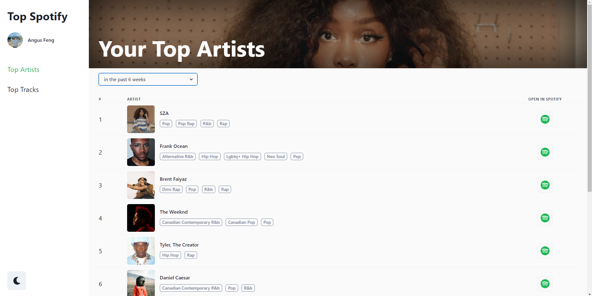

# Top Spotify

A web application to view your top Spotify artists and tracks

View the site at: https://topspotify.netlify.app/

## Features

- Connects to your personal Spotify account
- View your top artists and tracks in the past 4 weeks, 6 weeks and all time
- Desktop to mobile responsiveness
- Dark/Light mode switch

## Built With

- [React.js](https://reactjs.org/)
- [Chakra UI](https://chakra-ui.com/)
- [Express](https://expressjs.com/)
- [Spotify Web API](https://developer.spotify.com/)

## Available Scripts

In the project directory, you can run:

### `yarn start`

Runs the app in the development mode.\
Open [http://localhost:3000](http://localhost:3000) to view it in the browser.

The page will reload if you make edits.\
You will also see any lint errors in the console.

### `yarn build`

Builds the app for production to the `build` folder.\
It correctly bundles React in production mode and optimizes the build for the best performance.

The build is minified and the filenames include the hashes.\
Your app is ready to be deployed!

See the section about [deployment](https://facebook.github.io/create-react-app/docs/deployment) for more information.

## Roadmap

These are some features that may be implemented in the future!

- Switch between Spotify users
- Spotify recommendations for you
